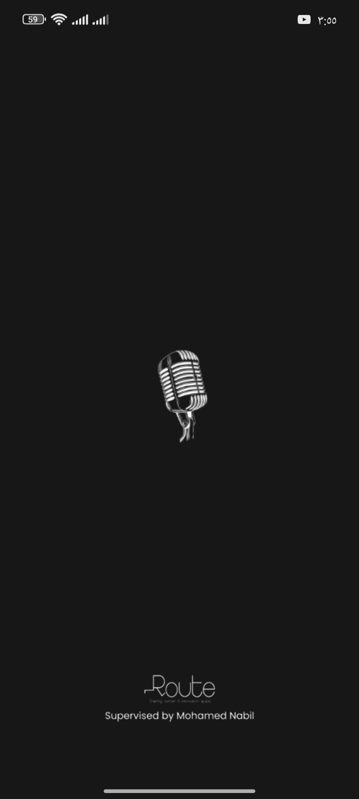
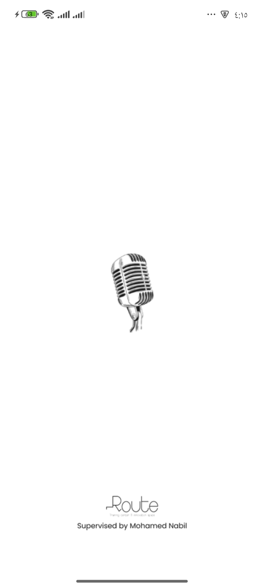
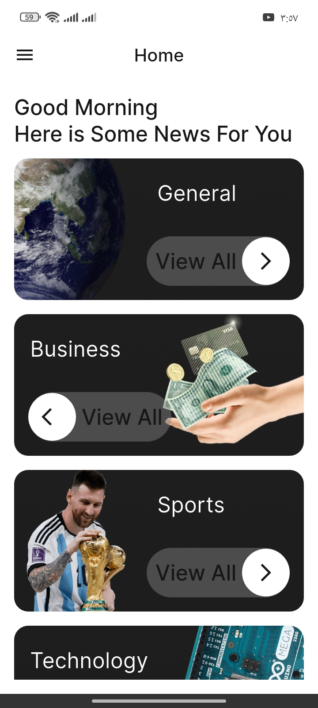
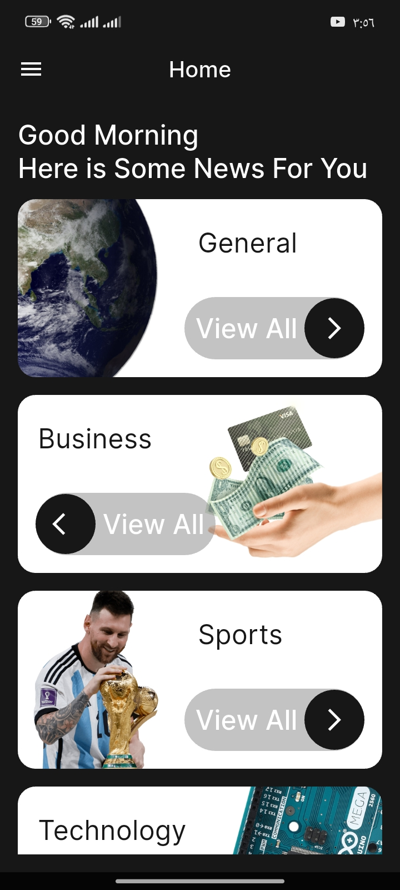
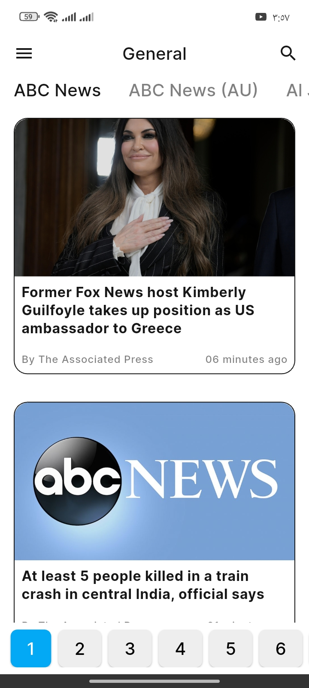
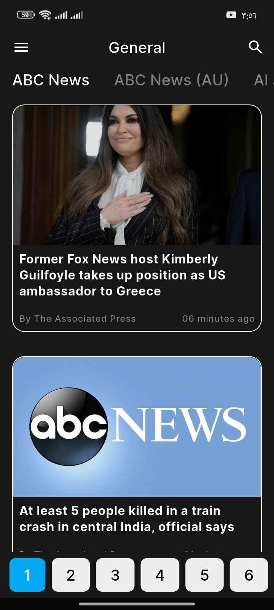
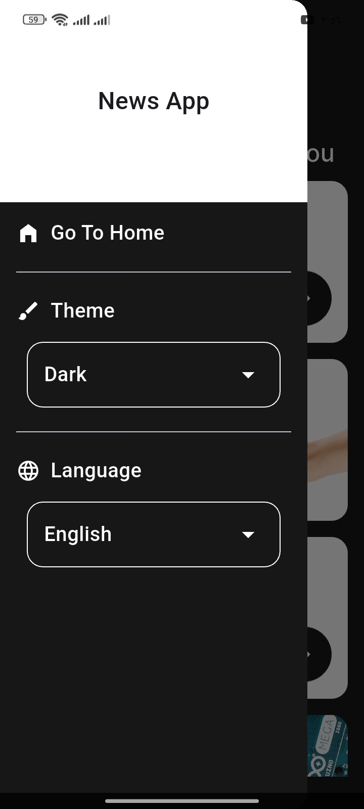
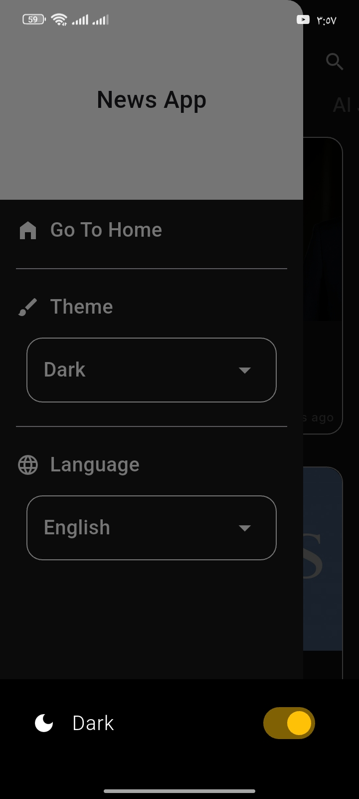

# 📰 News App

## Description
A simple News app that contains multiple news sections such as **General**, **Business**, **Entertainment**, **Health**, and **Science**.  
Built with **Flutter**.

🧩 The app also includes **pagination** for loading more articles dynamically as the user scrolls — providing a smooth and efficient browsing experience.

---

## Getting Started 🚀

### Dependencies 📦

This project uses the following packages:

- [cupertino_icons](https://pub.dev/packages/cupertino_icons) – iOS style icons
- [http](https://pub.dev/packages/http) – HTTP client
- [flutter_native_splash](https://pub.dev/packages/flutter_native_splash) – Splash screen
- [google_fonts](https://pub.dev/packages/google_fonts) – Google Fonts package
- [webview_flutter](https://pub.dev/packages/webview_flutter) – Flutter plugin for embedding a web view
- [flutter_bloc](https://pub.dev/packages/flutter_bloc) – State management using Bloc
- [bloc](https://pub.dev/packages/bloc) – Core Bloc package

---

### Dev Dependencies 🛠
- [flutter_test](https://pub.dev/packages/flutter_test) – Testing framework for Flutter
- [flutter_lints](https://pub.dev/packages/flutter_lints) – Recommended lints for Flutter projects

---

## Features ✨
- 🌙 Light & Dark mode support
- 🌐 Multi-language support (English & Arabic)
- 📰 News categorized by topics
- 🔍 Powerful search functionality
- ♻️ Pagination for smooth article loading
- 🧭 Drawer with theme & language options

---

## Screenshots 📸

  
  
  
  
  
  
  
  
  

